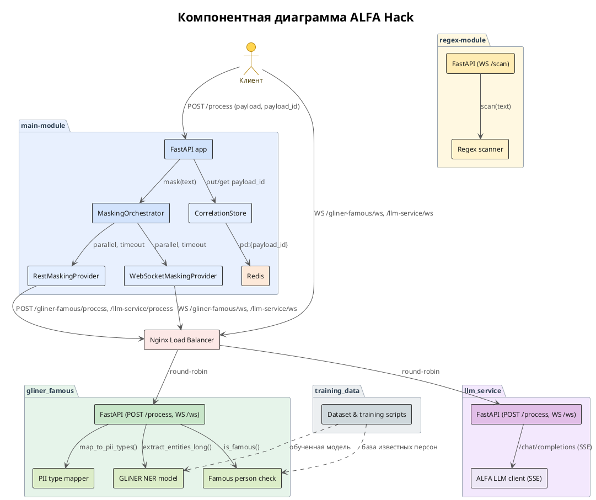
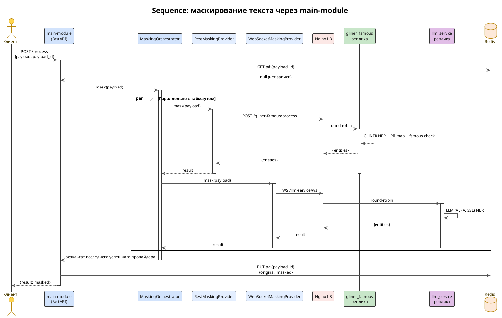

# ALFA Hack

Проект для хакатона Альфа.

## Структура

- `gliner_famous/` — сервис на базе GLiNER для распознавания сущностей (FastAPI + WebSocket).
- `llm_service/` — сервис распознавания сущностей на базе LLM (провайдер ALFA), тот же контракт, что и `gliner_famous`.
- `load_balanser/` — балансировщик нагрузки на базе Nginx.

## Архитектура

Компонентная и sequence-диаграммы (PlantUML) лежат в `docs/`:

- `docs/component.puml` — компонентная диаграмма системы;
- `docs/sequence.puml` — sequence-диаграмма маскирования текста через `main-module`.





## Запуск реплик контейнеров

### 1. Сборка и запуск реплик `gliner_famous`

Соберите образ сервиса:

```bash
docker build -t gliner_famous ./gliner_famous
```

Запустите несколько реплик (например, две) на разных портах:

```bash
docker run -d --name gliner1 -p 8001:8000 gliner_famous
docker run -d --name gliner2 -p 8002:8000 gliner_famous
```

Сервис слушает порт `8000` внутри контейнера и отдаёт два эндпоинта:
- `POST /process` — обработка текста (JSON `{"text": "..."}`);
- `WS /ws` — WebSocket-обработка текста.

### 2. Сборка и запуск `llm_service`

Сервис делает то же, что и `gliner_famous` (тот же контракт: `POST /process` и `WS /ws`),
но вместо локальной модели GLiNER использует запрос к LLM провайдера ALFA.
Ориентирован на скорость: один запрос к LLM возвращает все сущности сразу.

Креды провайдера ALFA задаются в `.env` (см. `.env.example`):

```bash
LLM_BASE_URL=https://alfagen.alfabank.ru/continue-dev/
LLM_API_KEY=<ваш ключ>
LLM_MODEL=deepseek-ai/DeepSeek-V4-Flash-0731
```

Соберите образ:

```bash
docker build -t llm_service ./llm_service
```

Запустите реплики на разных портах:

```bash
docker run -d --name llm1 -p 8003:8000 llm_service
docker run -d --name llm2 -p 8004:8000 llm_service
```

Сервис слушает порт `8000` внутри контейнера и отдаёт те же эндпоинты, что и `gliner_famous`:
- `POST /process` — обработка текста (JSON `{"text": "..."}`);
- `WS /ws` — WebSocket-обработка текста.

Проверка:

```bash
curl -X POST http://localhost:8003/process \
  -H "Content-Type: application/json" \
  -d '{"text": "Иван Петров работает в Альфа-Банке"}'
```

> Примечание: `.env` не коммитится в git (добавлен в `.gitignore`). Для локального
> запуска без Docker скопируйте `.env.example` в `.env` и заполните ключ.

### 3. Сборка и запуск `load_balanser`

Соберите образ балансировщика:

```bash
docker build -t load_balanser ./load_balanser
```

Запустите его, передав списки бэкендов через переменные окружения `GLINER_BACKENDS` и `LLM_BACKENDS` (имена хостов через пробел):

```bash
docker run -d --name lb -p 8080:80 \
  -e GLINER_BACKENDS="gliner1:8000 gliner2:8000" \
  -e LLM_BACKENDS="llm1:8000 llm2:8000" \
  --link gliner1 --link gliner2 --link llm1 --link llm2 \
  load_balanser
```

Если `GLINER_BACKENDS` не задан, по умолчанию используется один бэкенд `gliner1:8000`.
Если `LLM_BACKENDS` не задан, по умолчанию используется один бэкенд `llm1:8000`.

Балансировщик слушает порт `80` внутри контейнера и проксирует запросы на реплики:
- `WS /gliner-famous/ws` → `/ws` (WebSocket, round-robin);
- `POST /gliner-famous/process` → `/process`;
- `WS /llm-service/ws` → `/ws` (WebSocket, round-robin);
- `POST /llm-service/process` → `/process`.

### 4. Проверка

HTTP-запрос через балансировщик:

```bash
curl -X POST http://localhost:8080/gliner-famous/process \
  -H "Content-Type: application/json" \
  -d '{"text": "Иван Петров работает в Альфа-Банке"}'
```

WebSocket-подключение через балансировщик:

```bash
wscat -c ws://localhost:8080/gliner-famous/ws
```

HTTP-запрос к `llm_service` через балансировщик:

```bash
curl -X POST http://localhost:8080/llm-service/process \
  -H "Content-Type: application/json" \
  -d '{"text": "Иван Петров работает в Альфа-Банке"}'
```

WebSocket-подключение к `llm_service` через балансировщик:

```bash
wscat -c ws://localhost:8080/llm-service/ws
```

> Примечание: для связи контейнеров по именам (`gliner1`, `gliner2`) используйте общую Docker-сеть вместо `--link` (устаревший флаг), например `docker network create alfa-net` и подключите все контейнеры к ней.